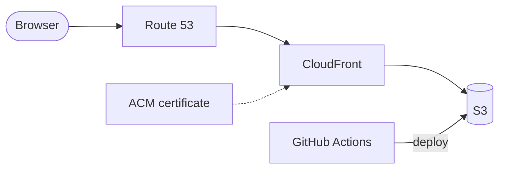

# Wonder Lab

**A hands-on science lab for a third grader.** Each topic his class covers becomes a set of small experiments he can tap, drag and pour his way through, with a friendly guide who explains everything out loud.

Live at **https://wonderlab.camp**

## What it's like

You start on a map of the Lab's grounds. Each topic is a building along a winding trail (a greenhouse for **Plants & Seeds**), and a little bean seed named **Pip** walks to whichever one you tap. Inside, every activity is a small hands-on scene:

- **Meet the Plant:** tap roots, stem, leaves, flower and pod to learn their jobs.
- **Open a Seed:** soak a bean, peel it, split it, and find the baby plant inside.
- **Flower Lab:** take a flower apart, then help a bee pollinate it.
- **Produce Lab:** cut open tomatoes, celery, radishes and more, look for seeds, and sort fruits from vegetables.
- **Grow a Bean:** water it, give it sun, and watch it go from seed to pods.
- **Seed Travel:** four ways seeds get around.
- **Leaf Factory:** give a leaf sunlight, water and air, and watch it make sugar and oxygen (photosynthesis).
- **Thirsty Celery:** color the water and watch it climb a celery stalk to the leaves.
- **Light Seeker:** move a lamp and watch a seedling bend toward it; tip the cup and the roots still grow down.
- **Plant Quiz:** stars for answers right on the first try.

Pip reads every line aloud. Discoveries earn stars and badges, finished topics earn trophies, and they're all on display in the **Trophy Hall**.

## How it's built

- **Drawn and voiced in the browser:** every picture is drawn in code and every sound effect is synthesized, with no images and no libraries.
- **Recorded narration:** Pip's lines are pre-recorded with AI text-to-speech in four voices.
- **Paced for a young kid:** Pip finishes explaining before the next tap counts.
- **Tested by playing:** an automated playthrough runs every activity on each change.
- **Ready for more topics:** a [design guide](docs/design.md) keeps the look consistent as new ones are added.

## Claude Code setup

The repo comes with a Claude Code setup in `.claude/`, so new topics and changes follow the same rules:

- **`/new-topic` and `/new-activity`:** plan and build a new class topic or activity in the house style.
- **`/record-voice`:** record Pip's new lines and check every clip.
- **`/walkthrough`:** play through every activity in a headless browser.
- **`/ship`:** take a change from branch to pull request to deploy.
- **Activity skill:** how an activity is put together.
- **Kid-content reviewer:** an agent that checks new text for a third grader.
- **Build check:** a hook that rebuilds and checks the page after every edit.

## How it's hosted

A static site on AWS, defined in Terraform and deployed by GitHub Actions on every merge.



- **S3:** stores the site.
- **CloudFront:** serves it over HTTPS.
- **ACM:** the certificate.
- **Route 53:** DNS for `wonderlab.camp`.

## Repo

```
src/      the app
voice/    Pip's narration
tests/    the automated playthrough
infra/    Terraform
docs/     the design guide
.claude/  the Claude Code setup
```

## Built with

JavaScript (Canvas 2D, Web Audio), Python, OpenAI text-to-speech, Terraform, AWS, GitHub Actions, Playwright, Claude Code.
