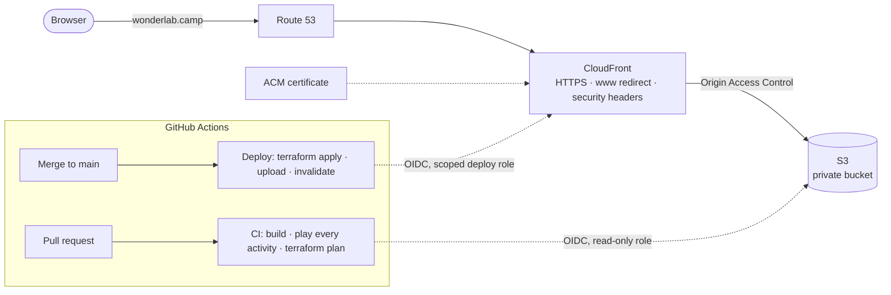

# Wonder Lab

**A hands-on science lab for a third grader.** Each topic his class covers becomes a set of small experiments he can tap, drag and pour his way through, with a friendly guide who explains everything out loud.

Live at **https://wonderlab.camp**

## What it's like

You start on a map of the Lab's grounds. Each topic is a building along a winding trail (a greenhouse for **Plants & Seeds**), and a little bean seed named **Pip** walks to whichever one you tap. Inside, every activity is a small hands-on scene:

- **Meet the Plant:** tap roots, stem, leaves, flower and pod to learn their jobs.
- **Open a Seed:** soak a bean overnight, rub off its seed coat, split it, and find the baby plant inside, just like the class did with real lima beans.
- **Flower Lab:** pull off petals and sepals, find the stamens and pistil, then fly a bee to pollinate it.
- **Grow a Bean:** water it and give it sun, and watch it go from seed to sprout to pods.
- **Seed Travel:** four ways seeds get around (wind, animals, water, and pods that pop).
- **Plant Quiz:** stars for answers right on the first try.

Pip reads every line aloud in a warm teacher's voice (four to choose from). Finding things earns stars, finishing an activity earns a badge, and finishing a topic earns its trophy. They're all on display in the **Trophy Hall** at the end of the trail.

## What's interesting under the hood

- **No images, no libraries.** Every picture is drawn in code with Canvas 2D: the scenes, the characters, the map, even the icons. Every sound effect is synthesized live with the Web Audio API. The whole app is one HTML page, assembled from plain JavaScript files by a 40-line Python build script.
- **Recorded narration with a quality check.** The script collects every line Pip can say straight from the source code. Each line is recorded with OpenAI's `gpt-4o-mini-tts`, steered to sound like a warm teacher, and every clip is transcribed back with `gpt-4o-transcribe` to catch any that came out wrong. Clips are packed into one content-hashed audio file per voice and decoded on demand. There's no robotic device-voice fallback: about 200 lines × 4 voices, all recorded.
- **Pacing built for an 8-year-old.**
  - Long explanations hold taps until Pip finishes ("Listen to Pip first").
  - Follow-up lines wait for a breath instead of talking over him.
  - Rapid taps start just one line: the newest wins.
  - Reminders are shown on screen first and spoken once.
- **An end-to-end test that plays the whole app.** A Playwright script runs every activity start to finish on every pull request, along with the map, the Trophy Hall and topic theming: 63 checks. They include the pacing (nothing talks over Pip), that every line said has a recording in every voice, and pixel checks that Pip's costumes never hide his face.
- **Built to grow.** The map, the Trophy Hall, per-topic colors and Pip's costumes (a space helmet, a rain hat, lab goggles) are all ready for the next topic. The look is written down in a [design guide](docs/design.md) so it stays consistent.

## How it's hosted

A static site on AWS, defined entirely in Terraform and shipped only through GitHub Actions. There are no AWS keys anywhere: GitHub signs in to AWS with short-lived OIDC sessions.



| Resource | Role |
|---|---|
| **S3** | A private bucket holding the page and the voice packs, readable only by CloudFront (Origin Access Control). Versioned, so a bad deploy can roll back. |
| **CloudFront** | HTTPS, HTTP/2 and 3, compression, managed security headers. A CloudFront Function redirects `www` to the root domain. Voice packs are cached for a year (their names change when they change); the page is always fresh. |
| **ACM** | The TLS certificate, validated through DNS. |
| **Route 53** | DNS for `wonderlab.camp`. |
| **S3 (state)** | Terraform state, with S3-native locking. |
| **IAM (OIDC roles)** | One read-only role for pull-request plans. One deploy role for merges to `main`, which can change only this site's resources and has no IAM permissions of its own. |

**Security notes:**
- **Least privilege:** the deploy role's CloudFront and certificate permissions are scoped by a `Project` tag, so it can't modify or relabel anything else in the AWS account. Only the `main` branch can deploy, and pull-request plans can't write anything.
- **Supply chain:** workflow actions are pinned to commit SHAs, and Dependabot proposes updates.
- **The one manual step:** a small Terraform bootstrap creates the state bucket and the CI roles, since CI can't create the role it signs in with.

## A quick tour of the repo

```
src/          the app: markup and styles, shared drawing and sound, one file per activity, the map, the Trophy Hall
voice/        the narration pipeline: collect lines, record, transcribe-check, pack
tests/        the end-to-end walkthrough
infra/        Terraform for the site, plus the one-time bootstrap for state and CI roles
docs/         the design guide
.github/      CI and Deploy workflows, Dependabot
```

## Built with

JavaScript (Canvas 2D, Web Audio), Python, OpenAI text-to-speech and transcription, Terraform, AWS (S3, CloudFront, ACM, Route 53, IAM), GitHub Actions and Playwright.

Progress is saved in the browser, on that device only. No accounts, no analytics.
